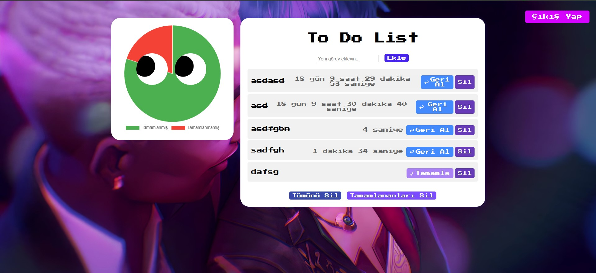

# Advanced Task Manager

## 📸 Screenshots

| Login Interface | Task Dashboard |
| :--- | :--- |
|  |  |

A full-stack To-Do List application designed for efficient task management with integrated user authentication and data visualization.

## 🚀 Key Features

* **User Authentication**: Secure login and registration system.
* **Task Management (CRUD)**: Full Create, Read, Update, and Delete operations for tasks.
* **Data Visualization**: An interactive pie chart dashboard to track completed vs. pending tasks.
* **Time Tracking**: Integrated timers to monitor the duration of each task.
* **Responsive UI**: A user-friendly interface optimized for various screen sizes.

## 🛠 Tech Stack

* **Backend**: PHP / Python.
* **Frontend**: HTML5, CSS3, JavaScript.
* **Database**: MySQL.
* **Visualization**: Chart.js / Similar library.


## ⚙️ Installation

1. Clone the repository:
   ```bash
   git clone [https://github.com/Nurullah-Esat/todo-app.git](https://github.com/Nurullah-Esat/todo-app.git)
